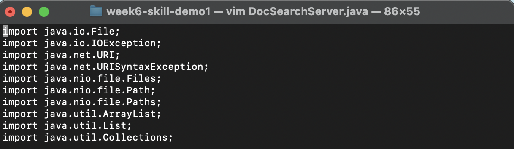
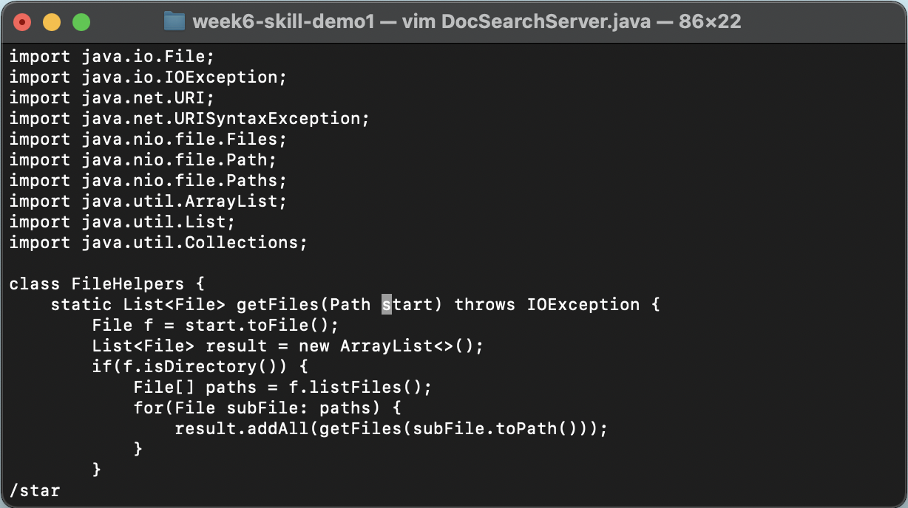
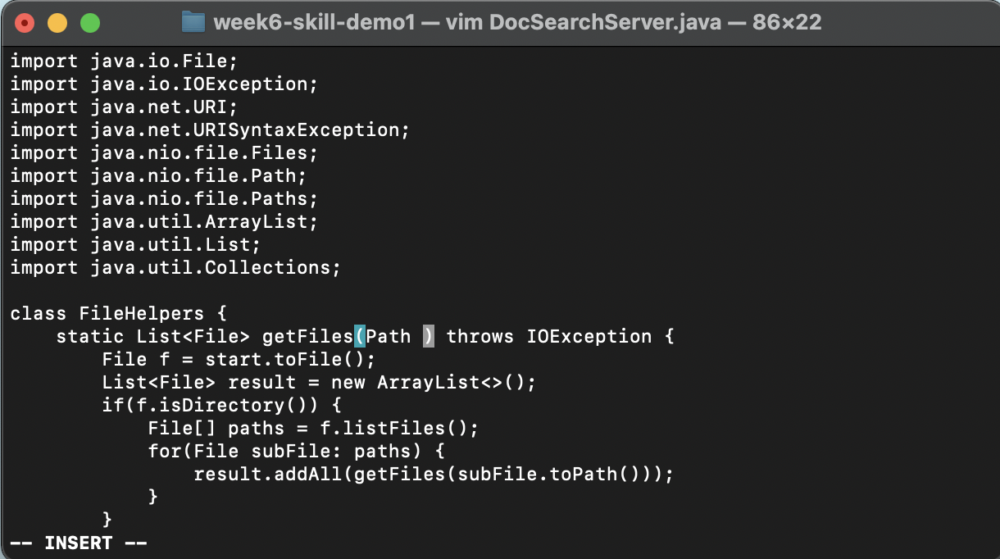
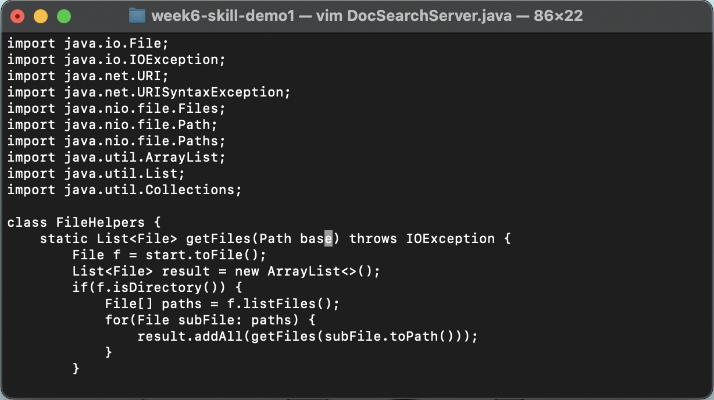
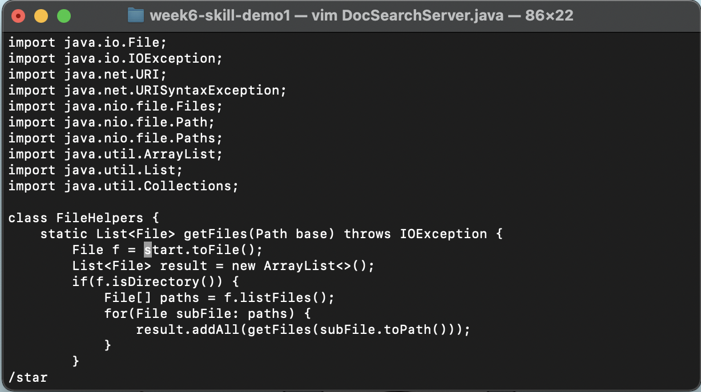
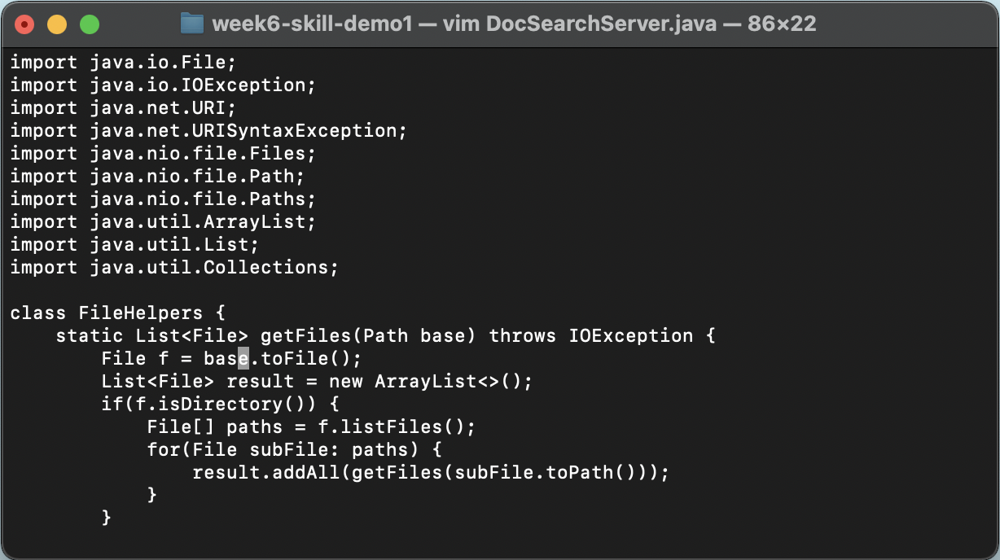
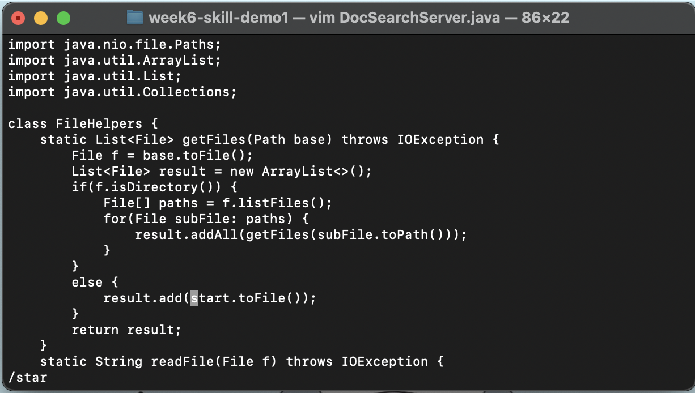
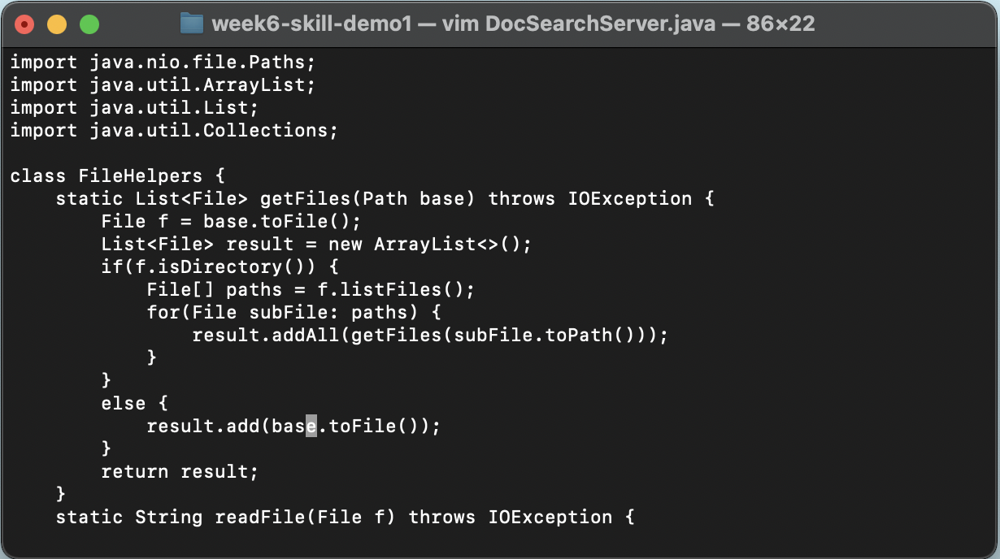
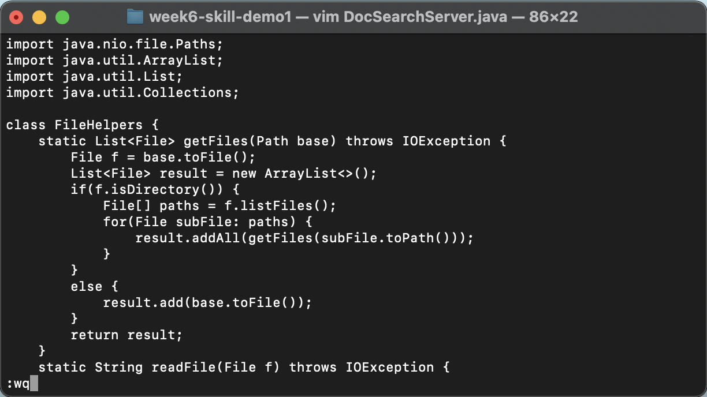
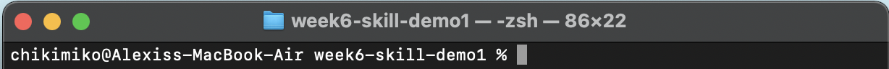

## Week 7 Lab Report 4

### Part 1

#### Changing the name of the start parameter and its uses to base

##### Opening File to Edit with Vim

`v` 
`i` 
`m` 
`<space>` 
`<shift>`+`d` 
`<tab>` 
`<enter>`  

##### Looking for Phrases to Change
`/` 
`s` 
`t` 
`a` 
`r` 
`<enter>`  

`c`
`e`  

`b` 
`a` 
`s` 
`e` 
`<esc>`  

`n`  

`.`  

`n`  

##### Exiting Vim

`.`  

`<shift>` + `;` 
`w` 
`q`  

`<enter>`  

___

### Part 2

Through the Visual Studio Code method, it had taken me **1 minute and 23 seconds** to preform the task. On the other hand, it had taken me **26 seconds** to preform the task through Vim while I was already on the remote server. 

Which of these two styles would you prefer using if you had to work on a program that you were running remotely, and why?
> Of these two styles, my preferance would depend on what task I am trying to preform. If I am writing a lot of code at once for the first time, I would definately prefer writing the code through VS Code because I am more familiar with the IDE, but if I was more used to Vim or if I was just making a minor edit, using Vim would be more preferable. 

What about the project or task might factor into your decision one way or another? (If nothing would affect your decision, say so and why!)
> As I had mentioned before, the task does play a factor into my decision on which style I would prefer to use. For smaller tasks, such as changing minor details in a file on the remote server, I would prefer Vim. On the other hand, due to my familiarity with VS Code, I would generally prefer to start from scratch on VS Code. 