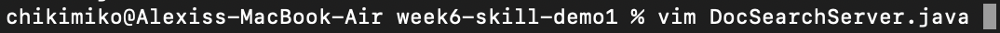

## Week 7 Lab Report 4

### Part 1

#### Opening File to Edit with Vim

`v` 
`i` 
`m` 
`<space>` 
`<shift>`+`d` 
`<tab>` 
`<enter>`  

#### Looking for Phrases to Change
`/` 
`s` 
`t` 
`a` 
`r` 
`<enter>`  

`c`
`e`  

`b` 
`a` 
`s` 
`e` 
`<esc>`  

`n`  

`.`  

`n`  

#### Exiting Vim

`.`  

`<shift>` + `;` 
`w` 
`q`  

`<enter>`  

