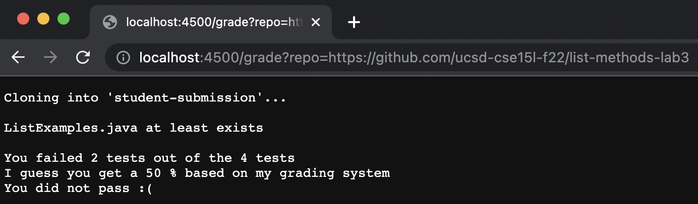
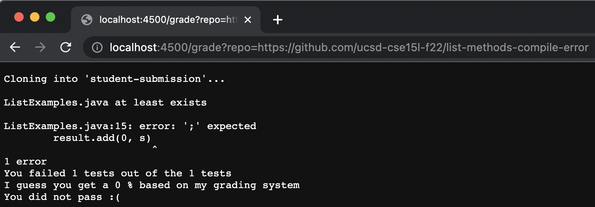
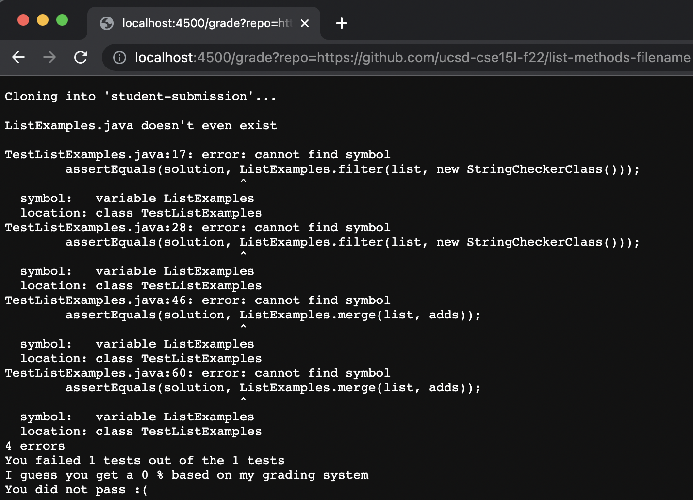

## Week 8 Lab Report 5

### `grade.sh` in a code block
```
rm -rf student-submission > line1.txt 2> line1err.txt
git clone $1 student-submission > line2.txt 2> line2err.txt

CP=".:lib/hamcrest-core-1.3.jar:lib/junit-4.13.2.jar" > line4.txt 2> line4err.txt

echo > line6.txt 2> line6err.txt

if [ -f student-submission/ListExamples.java ] > line8.txt 2> line8err.txt
then > line9.txt 2> line9err.txt
        echo "ListExamples.java at least exists" > line10.txt 2> line10err.txt
else > line11.txt 2> line11err.txt
        echo "ListExamples.java doesn't even exist" > line12.txt 2> line12err.txt
fi > line13.txt 2> line13err.txt

echo > line15.txt 2> line15err.txt

cp -r ./lib/ Server.java GradeServer.java TestListExamples.java ./student-submission > line17.txt 2> line17err.txt
cd ./student-submission > line18.txt 2> line18err.txt
mkdir lib > line19.txt 2> line19err.txt
cp hamcrest-core-1.3.jar junit-4.13.2.jar lib > line20.txt 2> line20err.txt

javac -cp $CP *.java > line22.txt 2> line22err.txt
java -cp $CP org.junit.runner.JUnitCore TestListExamples > output.txt 2> line23err.txt

SCORE=`grep 'Tests run:' output.txt` > line25.txt 2> line25err.txt

IFS=', ' read -r -a array <<< $SCORE > line27.txt 2> line27err.txt

echo "You failed" ${array[4]} "tests out of the" ${array[2]} "tests" > line29.txt 2> line29err.txt

declare -i GRADE=(${array[2]}-${array[4]})*100/${array[2]} > line31.txt 2> line31err.txt
declare -i PASS=7*100/10 > line32.txt 2> line32err.txt

echo "I guess you get a" $GRADE "% based on my grading system" > line34.txt 2> line34err.txt

if [[ $GRADE -ge $PASS ]] > line35.txt 2> line35err.txt
then > line36.txt 2> line36err.txt
        echo "You pass :)" > line37.txt 2> line37err.txt
else > line38.txt 2> line38err.txt
        echo "You did not pass :(" > line39.txt 2> line39err.txt
fi > line40.txt 2> line40err.txt

echo > line42.txt 2> line42err.txt
```

### Screenshots of 3 Different Student Submissions

[](./week-8-images/lab3.png)

[](./week-8-images/compile-error.png)

[](./week-8-images/filename.png)

### Trace of filename Submission

line | stdout | stderr | return code 
--- | --- | --- | --- 
1 | line1.txt | line1err.txt | 0 
2 | line2.txt | line2err.txt | 0 
4 | line4.txt | line4err.txt | 0 
6 | line6.txt | line6err.txt | 1 (if statement)
8 | line8.txt | line8err.txt | not run 
9 | line9.txt | line9err.txt | not run 
10 | line10.txt | line10err.txt | not run 
11 | line11.txt | line11err.txt | not run 
12 | line12.txt | line12err.txt | not run 
13 | line13.txt | line13err.txt | 0 
15 | line15.txt | line15err.txt | 0 
17 | line17.txt | line17err.txt | 0 
18 | line18.txt | line18err.txt | 0 
19 | line19.txt | line19err.txt | 0 
20 | line20.txt | line20err.txt | 0 
22 | line22.txt | line22err.txt | 1 
23 | output.txt | line23err.txt | 1 
25 | line25.txt | line25err.txt | 0 
27 | line27.txt | line27err.txt | 0 
29 | line29.txt | line29err.txt | 0 
31 | line31.txt | line31err.txt | 0 
32 | line32.txt | line32err.txt | 0 
34 | line34.txt | line34err.txt | 0 
35 | line35.txt | line35err.txt | 1 (if statement)
36 | line36.txt | line36err.txt | not run 
37 | line37.txt | line37err.txt | not run 
38 | line38.txt | line38err.txt | 1 
39 | line39.txt | line39err.txt | 0 
40 | line40.txt | line40err.txt | 0 
42 | line42.txt | line42err.txt | 0 

## if statements
`if [ -f student-submission/ListExamples.java ]` = false

This is because there is no file name called ListExamples.java.

`if [[ $GRADE -ge $PASS ]]` = false

This is because they didn't get a good enough grade to pass.